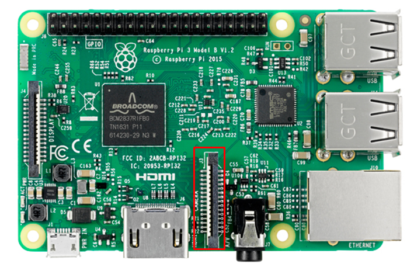
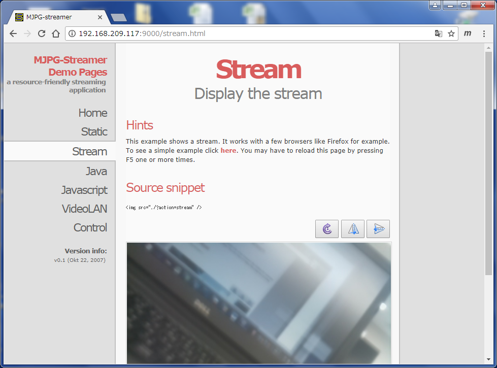

# 1. セットアップ

<table>
<tr><td>
<b>用意するもの</b> 
・RaspberryPi 
・電源ケーブル 
・SDカード 
・HDMIケーブル 
 
・カメラモジュール 
 
・ディスプレイ（HDMI端子があるもの） 
・キーボード（USB接続） 
・マウス（USB接続） 
</td></tr>
</table>

 

## 1.1. カメラモジュールの取付

コネクタの位置

HDMIポート側が銀色、イーサネットポート側が青色になるように差し込む。

 

## 1.2. Raspberry Piの起動

- SDカードをRaspberry Pi本体に挿し込む

- ディスプレイ、キーボード、マウスを接続する

- Raspberry Pi本体をUSB電源につなぐ

- Raspberry Piを起動する

Raspberry Pi本体には電源スイッチはありません。電源をつなぐと起動します。

 

ここから先の作業はRaspbianのターミナルを使って行います。

 

## 1.3. Pi Cameraがアクティブになっているか確認する

    vcgencmd get_camera

正しく動いていれば`supported=1 detected=1`という結果が返ってくる。

 

## 1.4. ストリーミング配信プログラム(mjpg-streamer)の確認
（「A. MNIST文字認識」、「B. Kerasによる物体識別」を行う場合）

下記コマンドを実行し、mjpg-streamerを起動する。

    cd
    ./start_stream.sh

 

WEBブラウザでラズパイのIPアドレス、ポート9000番にアクセスすることでカメラからの配信画像を見ることができる。　例：http://localhost:9000  

（ブラウザがIEの場合に表示されなかったので、ChromeかFireFoxでやってみる。）

 

## 1.5. 無線LANの接続設定（必要ないと思われる）

    sudo raspi-config

と打って設定画面に入り、以下の設定を行う。

- Network Options -> Wi-fi -> 無線LANのSSID/passphraseを設定

 

# 2. 終了

Raspbianをシャットダウンする。

    sudo shutdown -h now

SDカードのアクセス(緑LED点灯)が消えたら、電源を切る。

  

# A. MNIST文字認識

#### 準備
1.4.の作業を行い、mjpg-streamerが起動していること。

#### ニューラルネットワークによる推論

    cd /home/pi/deep-learning-from-scratch/ch03
    python3 digit_recognition_NN.py

「Ctl+C」で終了できる。

 

#### 畳み込みニューラルネットワークによる推論

    cd /home/pi/deep-learning-from-scratch/ch07
    python3 digit_recognition_CNN.py

「Ctl+C」で終了できる。

 

# B. Kerasによる物体識別

#### 準備
1.4.の作業を行い、mjpg-streamerが起動していること。

#### 物体識別のソースコードを実行する。

    cd
    python3 keras_ResNet50_2.py

- 「Using TensorFlow backend.」というメッセージが出てから結果が出るまでに時間がかかる。
- 「Ctl+C」で終了できる。

 

# C. OpenCV + SSD_Kerasによる物体検出

#### 準備
注）ここではmjpg-streamerは立ち上げないこと。

mjpg-streamerを終了させたいときは、psコマンドでプロセス番号を調べてkillコマンドで終了させる。

 

    sudo modprobe bcm2835-v4l2
    cd
    cd ssd_keras/testing_utils

 

#### Pi Cameraを使ったリアルタイム動画
    python3 stream_test.py

#### フリー動画（001～006.mp4）を使う場合（「001.mp4」の部分を変えてみてください）
    python3 stream_test.py 001.mp4

- 「Using TensorFlow backend.」というメッセージが出てから結果が出るまでに時間がかかる。
- 動画が始まったら、「i」キーを押すと、その時点のフレーム画像を使って物体検出される。（長くて18秒くらいかかる）
- 「q」またはターミナル上で「Ctl+C」で終了できる。

- 分類できるクラスは以下の通り

<table>
<tr>
  <td>飛行機</td><td>自転車</td><td>鳥</td><td>ボート</td><td>ボトル</td>
</tr>
<tr>
  <td>バス</td><td>車</td><td>猫</td><td>椅子</td><td>牛</td>
</tr>
<tr>
  <td>ダイニングテーブル</td><td>犬</td><td>馬</td><td>バイク</td><td>人</td>
</tr>
<tr>
  <td>鉢植え</td><td>羊</td><td>ソファー</td><td>電車</td><td>TVモニター</td>
</tr>
</table>
