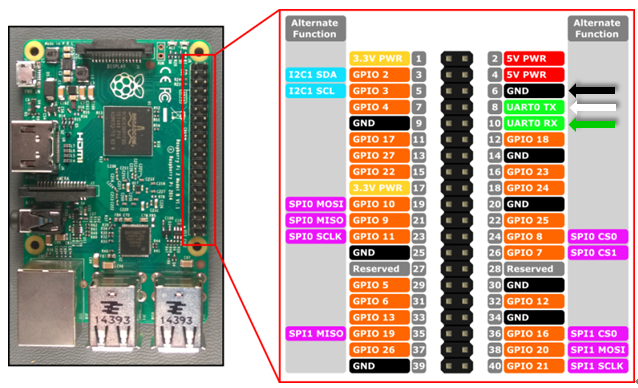
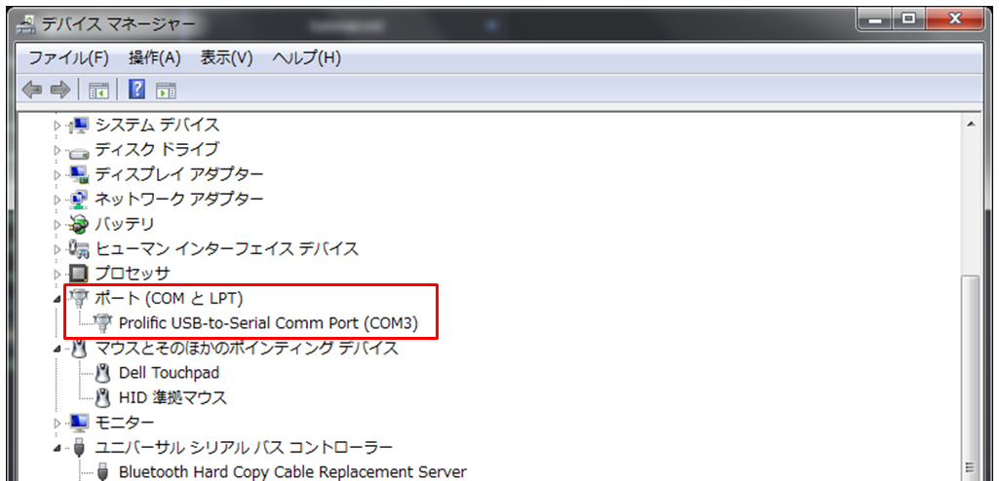
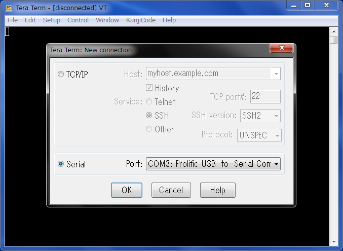
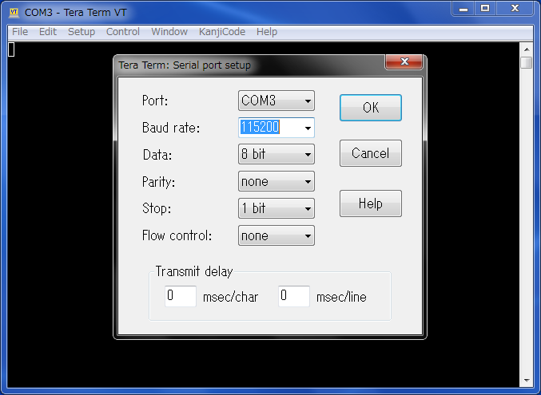
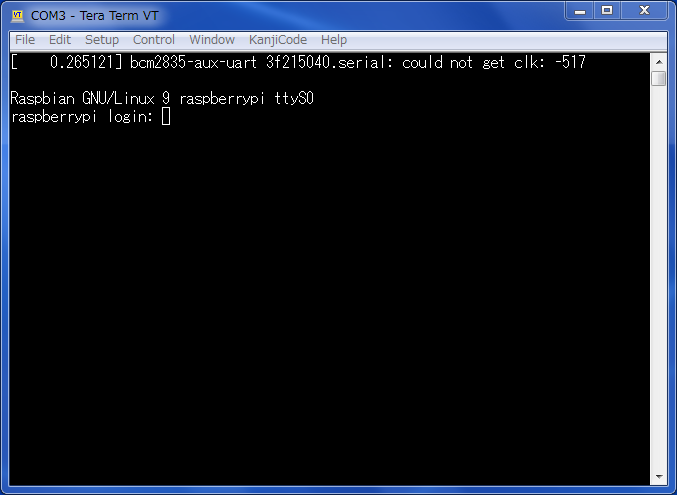

# 1. Raspberry Pi3とパソコンをシリアル接続する

## 1.1. SDカード上のファイルの編集
SDカードをPCのSDカードリーダーで開き、`boot`ドライブ直下の`config.txt`の最後尾に

    enable_uart=1

という行を追記する。

 
## 1.2. USB-シリアルケーブルの接続

**ラズパイ側**

　　４色のコネクターをラズパイのPINに接続する。

| コネクターの色 | ラズパイのPIN |
|:-------------:|:--------------|
| 黒 | 6番 GND |
| 白 | 8番 TX |
| 緑 | 10番 RX |
| 赤 | どこにも刺さない |

**PC側**

　　USBコネクターをPCのUSBポートに接続する。

 

## 1.3. ターミナル接続（Tera Term）

- デバイスマネージャーで接続されているポート番号を確認する

 
- PC上のターミナルソフトを開き、シリアル通信のポート番号を選択する。

 
- Setup -> Serial port：　ボーレートを115200に設定する。

 

## 1.4. Raspberry Piの起動

- SDカードをRaspberry Pi本体に挿し込む

- Raspberry Pi本体をUSB電源につなぐ

Raspberry Pi本体には電源スイッチはありません。電源をつなぐと起動します。

Raspbianの場合はユーザ：pi、パスワード：raspberryがデフォルト設定です。

 
