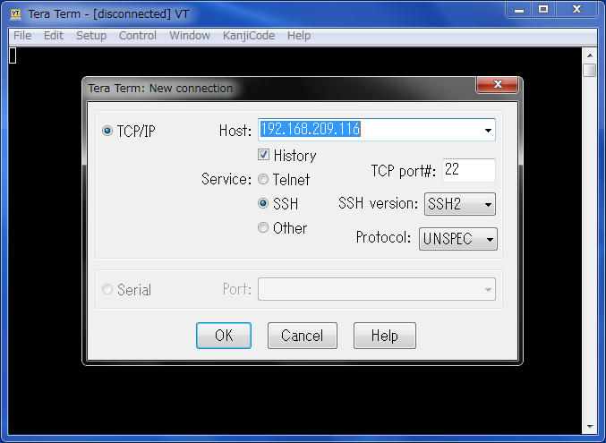

# 1. Raspberry Pi3を無線LAN接続する

## 1.1. SDカード上のファイルの編集
SDカードをPCのSDカードリーダーで開き、`boot`ドライブ直下に中身が空の`ssh`ファイルと、下記の内容の`wpa_supplicant.conf`ファイルを置く。使用する無線LAN環境に合わせてSSID名とパスワードの箇所を変える。

    country=GB
    ctrl_interface=DIR=/var/run/wpa_supplicant GROUP=netdev
    update_config=1

    network={
            ssid="<SSID名>"
            psk="<パスワード>"
    }

 

## 1.2. Raspberry Piの起動

- SDカードをRaspberry Pi本体に挿し込む

- Raspberry Pi本体をUSB電源につなぐ

Raspberry Pi本体には電源スイッチはありません。電源をつなぐと起動します。

 

## 1.3. IPアドレスの確認

下記の a) または b) の方法でIPアドレスを確認する。

### a)

- Raspberry PiとディスプレイをHDMIで接続して、RaspbianをGUIで見てみる。

- ターミナルで下記コマンドを実行し、IPアドレスを確認する。

    ip a

### b)

同じネットワークセグメントにつながっているパソコンから下記コマンドでRasperry PiのIPアドレスを探す(下記はWindows上のコマンドプロンプトを使う場合)。 Raspberry PiのMACアドレスはB8-27-EBから始まるので、それに紐づいているIPアドレスを探す。

    for /l %i in (0,1,254) do ping -w 1 -n 1 192.168.209.%i && arp -a 192.168.209.%i   
    arp -a

「192.168.209」の部分は社内の環境に合わせています。

 
 
- 複数のRaspberry Piを使う場合は個体の特定が必要。下記コマンドでRaspberry Pi本体の赤色LEDを点滅させ、上記で調べたIPアドレスと突き合わせることで本体のMACアドレスを把握することができる。

    echo heartbeat | sudo tee /sys/class/leds/led1/trigger

特定できたら下記コマンドで元の状態に戻しておく。

    echo input | sudo tee /sys/class/leds/led1/trigger

 

## 1.4. ターミナル接続（Tera Term）

PC上のターミナルソフトを開き、調べたIPアドレスを入力して接続する。

Raspbianの場合はユーザ：pi、パスワード：raspberryがデフォルト設定です。

 
