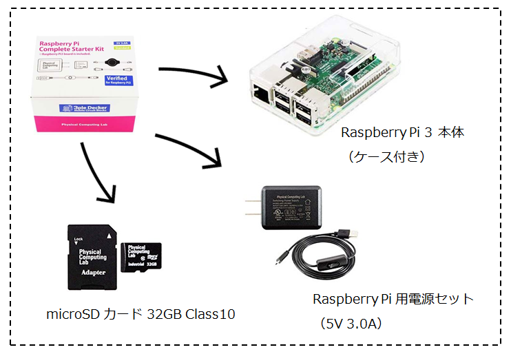
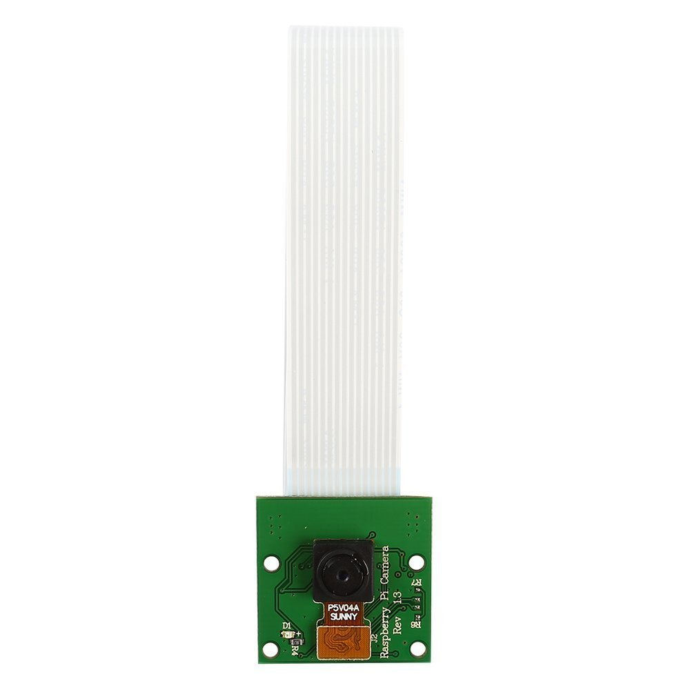
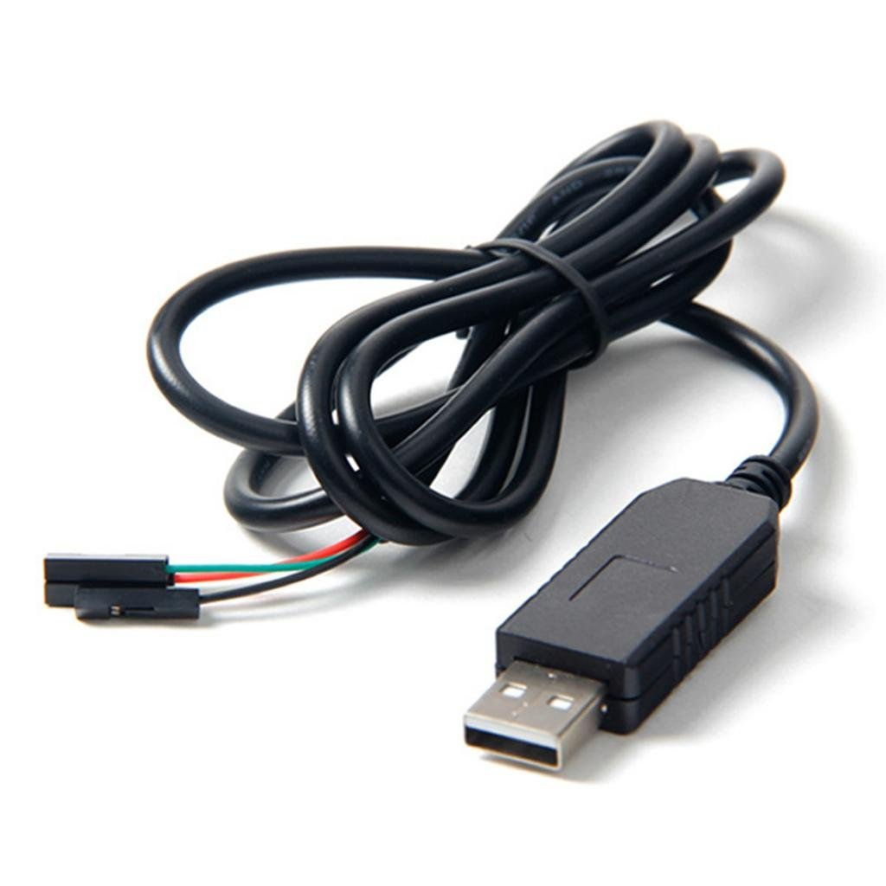

# 使用機材

[Raspberry Pi3 コンプリートスターターキット (Standard 32G)](https://www.amazon.co.jp/dp/B01MR4SQV5/ref=cm_sw_r_cp_ep_dp_IyEUAbA22BR71?th=1)

- 電源アダプター：スマホ用のUSB電源アダプタだとアンペア数が足りないので、2.5A以上、できれば上記のような3.0A品が良いです。

- SDカード：容量は16GB以上、スピードはClass10を選んでください。

[Raspberry Pi用カメラモジュール](https://www.amazon.co.jp/dp/B00FGKYHXA)

[USB-シリアル変換ケーブル](https://www.amazon.co.jp/dp/B00K7YYFNM)

