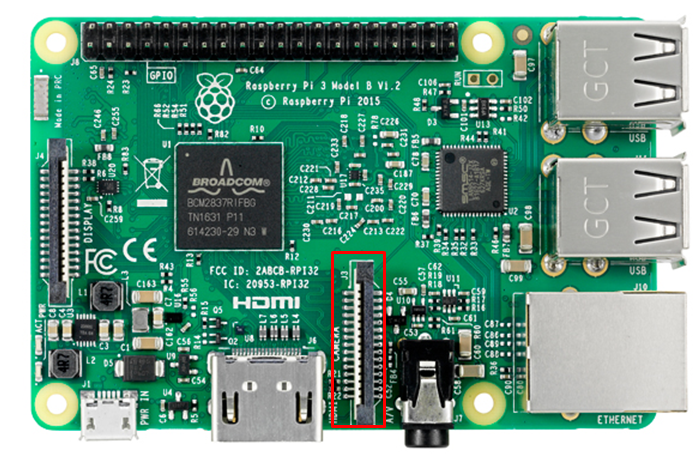
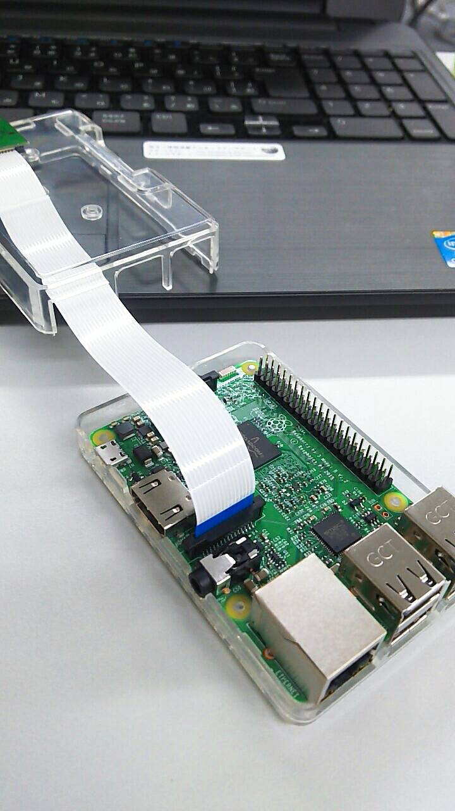
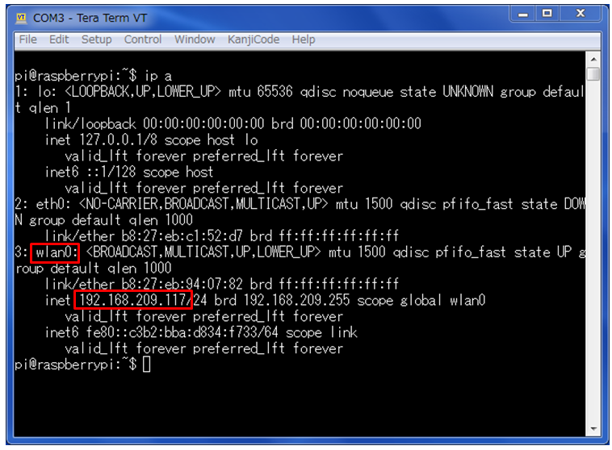
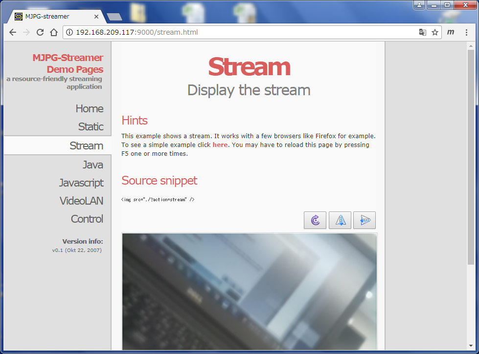
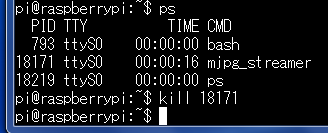
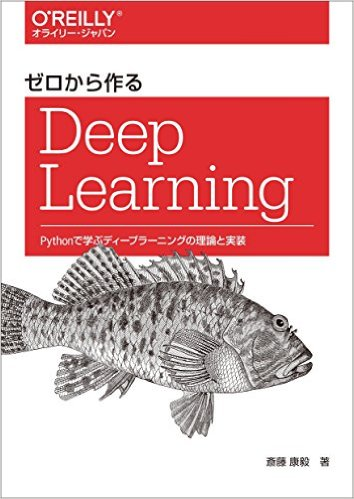

# 1. セットアップ

## 1.1. カメラモジュールの取付

**作業の前に**

このカメラは、静電気によって損傷するおそれがあります。グレーの静電気防止バッグからカメラを取り出す際は、地面に接地されている物体（ラジエーターや水道管など）に触れて静電気を放電してから、作業を始めてください。

 
コネクタの位置

HDMIポート側が銀色、イーサネットポート側が青色になるように差し込む。

 

## 1.2. Raspberry Pi3とパソコンを接続する

- [USB-シリアルケーブルで接続する場合](connection_uart.md)

- [無線LANで接続する場合](connection_wirelessLAN.md)

 

## 1.3. raspi-configの設定

    sudo raspi-config

と打って設定画面に入り、以下の設定を行う。

- Network Options -> Wi-fi -> 無線LANのSSID/passphraseを設定　（1.2.で無線LAN接続の設定をした場合は不要）
- Interfacing Options -> SSH -> (Would you line the SSH...) -> Yes　（1.2.で無線LAN接続の設定をした場合は不要）
- Localisation Options -> Change Timezone -> Asia -> Tokyo

- Interfacing Options -> Camera -> (Would you like the camera...) -> Yes 　 (カメラモジュールの有効化)

その後、画面の指示通りrebootする。

 

# 2. カメラ画像の配信

## 2.1. ストリーミング配信プログラム(mjpg-streamer)のインストール

#### Pi Cameraがアクティブになっているか確認する。

    vcgencmd get_camera

正しく動いていれば`supported=1 detected=1`という結果が返ってくる。

 

#### Raspbianのパッケージをアップデートする。

    sudo apt-get update
    sudo apt-get upgrade

| コマンド | 説明 |
|:-----------------:|:----------|
| sudo | 「スーパーユーザー（rootユーザー）」の権限が必要なコマンドを実行することができる。 |
| apt-get | APTはDebian系のディストリビューションのパッケージ管理システム |
| git clone | gitはバージョン管理システム。既存のリポジトリの複製を作る。 |
| cd | ディレクトリを移動する。 |
| wget | 指定したURLのファイルをダウンロードする。 |
| pip3 | pipはPythonのパッケージをインストール・管理するためのパッケージ管理システム |
| python3 | pythonを実行する。 |

 

#### ストリーミング配信プログラム(mjpg-streamer)をインストールする。

    sudo apt-get install -y libjpeg9-dev cmake
    sudo git clone https://github.com/jacksonliam/mjpg-streamer.git mjpg-streamer
    cd mjpg-streamer/mjpg-streamer-experimental
    sudo make
    cd
    sudo mv mjpg-streamer/mjpg-streamer-experimental /opt/mjpg-streamer

> メモ
>
>`E: Unable to locate package <パッケージ名>`というエラーメッセージが出たときは
>
    sudo apt-get update
>
>と打ってから、もう一度インストールしてみる。

 

## 2.2. mjpg-streamer起動スクリプトの作成

`nano start_stream.sh`と打ってnanoエディタを開き、下記の内容をコピーして保存終了する。

    #!/bin/bash

    if pgrep mjpg_streamer > /dev/null
    then
    echo "mjpg_streamer already running"
    else
    LD_LIBRARY_PATH=/opt/mjpg-streamer/ /opt/mjpg-streamer/mjpg_streamer -i "input_raspicam.so -fps 10 -q 50 -x 320 -y 240" -o "output_http.so -p 9000 -w /opt/mjpg-streamer/www" > /dev/null 2>&1&
    echo "mjpg_streamer started"
    fi

<table>
<tr>
<td>ファイルの保存</td><td>Ctrl+O</td>
</tr>
<tr>
<td>ファイルの終了</td><td>Ctrl+X</td>
</tr>
</table>

 

スクリプトの保存終了後、`chmod 755 start_stream.sh`と打って実行権限を与えておく。

 

## 2.3. mjpg-streamerの動作確認

下記コマンドを実行し、mjpg-streamerを起動する。

    ./start_stream.sh

 

（USB-シリアルケーブルで接続している場合）下記コマンドを実行し、ラズパイのIPアドレスを確認する。

    ip a

 

WEBブラウザでラズパイのIPアドレス、ポート9000番にアクセスすることでカメラからの配信画像を見ることができる。　例：http://192.168.xx.xx:9000  

 

mjpg-streamerを終了させたいときは、psコマンドでプロセス番号を調べてkillコマンドで終了させる。

 

# 3. MNIST文字認識の実装

## 3.1. 「ゼロから作るDeep Learning」のサンプルコードの入手

    cd
    git clone https://github.com/oreilly-japan/deep-learning-from-scratch.git

 

## 3.2. カメラを使ったMNIST文字認識プログラムの実装

#### 下記コマンドを実行し、mjpg-streamerを起動する。

    ./start_stream.sh

 

#### WEBブラウザでラズパイのIPアドレス、ポート9000番にアクセスする。
例：http://192.168.xx.xx:9000  

 

#### ニューラルネットワークによる推論

    cd /home/pi/deep-learning-from-scratch/ch03
    wget https://raw.githubusercontent.com/akiko-b/workshop/master/201804_rasp_ai/digit_recognition_NN.py
    python3 digit_recognition_NN.py

「Ctl+C」で終了できる。

 

#### 畳み込みニューラルネットワークによる推論

    cd /home/pi/deep-learning-from-scratch/ch07
    wget https://raw.githubusercontent.com/akiko-b/workshop/master/201804_rasp_ai/digit_recognition_CNN.py
    python3 digit_recognition_CNN.py

「Ctl+C」で終了できる。

 

# 4. Kerasによる物体識別の実装

## 4.1. スワップ領域の拡大

#### Kerasのインストールや実行時のメモリ不足を避けるために、OSのスワップ領域を増やす。

    sudo nano /etc/dphys-swapfile

CONF_SWAPSIZE=100の箇所の数字を2048に変更する。

 

#### ファイルをセーブしてエディタ終了。下記コマンドを実行する。

    sudo /etc/init.d/dphys-swapfile restart

 

#### 下記コマンドで確認

    free -h

 

## 4.2. TensorFlowのインストール

    cd
    sudo apt-get install libblas-dev liblapack-dev python3-dev libatlas-base-dev gfortran python3-setuptools
    sudo pip3 install numpy==1.13.3
    wget https://github.com/lhelontra/tensorflow-on-arm/releases/download/v1.7.0/tensorflow-1.7.0-cp35-none-linux_armv7l.whl
    sudo pip3 install tensorflow-1.7.0-cp35-none-linux_armv7l.whl

> メモ
>
>`sudo pip3～`でのインストール時に
>`TypeError: unsupported operand type(s) for -=: 'Retry' and 'int'`というエラーメッセージが出たときは
>
    wget https://bootstrap.pypa.io/get-pip.py
    python get-pip.py
    python3 get-pip.py
>
>と打ってから、もう一度インストールしてみる。

 

> メモ
>
>ここではTensorFlowのバージョン1.7.0を使うが、そのままインストールするとnumpyのバージョンが1.14のものが一緒にインストールされる。
>・・・が、1.14だとTensorFlowを使うときにエラーになってしまうので、バージョン1.13.3のnumpyをインストールしておく。
>（TensorFlowのインストール後にnumpyバージョン1.13.3をインストールする順番でもOK）

 

## 4.3. TensorFlow動作テスト

    python3
    （以下はPythonのインタプリタで）
    import tensorflow as tf
    hello = tf.constant('Hello, TensorFlow!')
    sess = tf.Session()
    print(sess.run(hello))

- 「Hello, TensorFlow!」と表示されたら動作確認OK。
- 「Ctl+D」で終了できる。

 

## 4.4. Kerasのインストール

    sudo apt-get install gcc libopenblas-dev cython libopenblas-base libatlas3-base
    sudo pip3 install keras　　（ ← 1時間15分ほどかかる）
    sudo pip3 install h5py
    sudo apt-get install python-h5py

 

## 4.5. Kerasによる物体識別１

    cd
    wget https://raw.githubusercontent.com/akiko-b/workshop/master/201804_rasp_ai/keras_ResNet50_1.py
    wget https://raw.githubusercontent.com/akiko-b/workshop/master/201804_rasp_ai/image/sample/cat.jpg
    wget https://raw.githubusercontent.com/akiko-b/workshop/master/201804_rasp_ai/image/sample/dog.jpg
    python3 keras_ResNet50_1.py cat.jpg
    python3 keras_ResNet50_1.py dog.jpg

- 最初の実行時にはDownloading data from..のメッセージとともにh5ファイルとjsonファイルがダウンロードされる。
- 「Using TensorFlow backend.」というメッセージが出てから結果が出るまでに時間がかかる。

 

## 4.6. Kerasによる物体識別２

#### 下記コマンドを実行し、mjpg-streamerを起動する。

    cd
    ./start_stream.sh

 

#### WEBブラウザでラズパイのIPアドレス、ポート9000番にアクセスする。
　例：http://192.168.xx.xx:9000  

 

#### 物体識別のソースコードをダウンロードし、実行する。

    wget https://raw.githubusercontent.com/akiko-b/workshop/master/201804_rasp_ai/keras_ResNet50_2.py
    python3 keras_ResNet50_2.py

「Ctl+C」で終了できる。

 

# 5. 終了

Raspbianをシャットダウンする。

    sudo shutdown -h now

SDカードのアクセス(緑LED点灯)が消えたら、電源を切る。

  

------------------------------------
# 特別編
# 6. OpenCV + SSD_Kerasによる物体検出の実装

<table>
<tr><td>
<b>追加で用意するもの</b> 
・ディスプレイ（HDMI端子があるもの） 
・HDMIケーブル 
・キーボード（USB接続） 
・マウス（USB接続） 
</td></tr>
</table>

 

## 6.1. OpenCVのインストール
OpenCVは画像認識に関連する機能のライブラリ。

    sudo pip3 install opencv-python
    sudo apt-get install libjasper-dev libqt4-dev

pythonで`import cv2`して動作確認する。

 

## 6.2. raspicam_cvのインストール
raspicam_cvライブラリを使用すると、OpenCVからRaspberryPiカメラモジュールを使用できるようになる。

    sudo apt-get install gcc g++ libx11-dev libxt-dev libxext-dev libgraphicsmagick1-dev libcv-dev libhighgui-dev

    mkdir -p ~/git/raspberrypi
    cd ~/git/raspberrypi
    git clone https://github.com/raspberrypi/userland.git
    cd userland
    ./buildme

    mkdir -p ~/git
    cd ~/git
    git clone https://github.com/robidouille/robidouille.git
    cd robidouille/raspicam_cv
    mkdir objs
    make

 

## 6.3. ssd_kerasのインストール
ssd_kerasは映像からの物体検出を可能にするライブラリ。(SSD : Single Shot MultiBox Detector)

    cd
    git clone https://github.com/rykov8/ssd_keras.git

 

#### 学習済みモデルのインストール
- [https://mega.nz/#F!7RowVLCL!q3cEVRK9jyOSB9el3SssIA](https://mega.nz/#F!7RowVLCL!q3cEVRK9jyOSB9el3SssIA)からweights_SSD300.hdf5をダウンロードする。

- ダウンロードしたファイルを``/home/pi/ssd_keras``に置く。

> 参考サイト　http://ai-coordinator.jp/ssd_keras-ubuntu#i-3

 

#### ssd.pyをインストール

    cd
    cd ssd_keras
    rm ssd.py
    wget https://gist.githubusercontent.com/anonymous/4c3105119a233cb33926651c3ea1966c/raw/81665eb0729ceba58d3b0b8fe16f6a5e94d91ab4/ssd.py

#### ssd_layers.pyを編集

    nano ssd_layers.py

ssd_layers.pyの`get_output_shape_for`を`compute_output_shape`に置換する。
Ctl+&yen;で置換できる。

> 参考サイト　http://d.hatena.ne.jp/natsutan/20170318/1489851945

 

## 6.4. 物体検出用プログラムをダウンロード

    cd
    cd ssd_keras/testing_utils
    mv videotest.py videotest_bk.py
    wget https://raw.githubusercontent.com/akiko-b/workshop/master/201804_rasp_ai/videotest.py
    wget https://raw.githubusercontent.com/akiko-b/workshop/master/201804_rasp_ai/stream_test.py

 

## 6.5. リアルタイム物体検出

#### 準備

- ここから先の作業はTeraTermではなくRaspbianのターミナルを使って行います。

- 一旦RaspberryPiの電源を切って、ディスプレイ、キーボード、マウスを接続し、電源を入れます。

- ここでは「mjpg-streamer」は立ち上げないようにしてください。

#### 実行

    sudo modprobe bcm2835-v4l2
    cd
    cd ssd_keras/testing_utils

> 参考サイト　https://www.raspberrypi.org/forums/viewtopic.php?t=176697

##### Pi Cameraを使ったリアルタイム動画
    python3 stream_test.py

##### フリー動画（001～006.mp4）を使う場合（「001.mp4」の部分をそれぞれ変えてみてください）
    wget https://github.com/akiko-b/workshop/raw/master/201804_rasp_ai/image/movie/001.mp4
    python3 stream_test.py 001.mp4

- 「Using TensorFlow backend.」というメッセージが出てから結果が出るまでに時間がかかる。
- 動画が始まったら、「i」キーを押すと、その時点のフレーム画像を使って物体検出される。（長くて18秒くらいかかる）
- 「q」またはターミナル上で「Ctl+C」で終了できる。

- 分類できるクラスは以下の通り

<table>
<tr>
  <td>飛行機</td><td>自転車</td><td>鳥</td><td>ボート</td><td>ボトル</td>
</tr>
<tr>
  <td>バス</td><td>車</td><td>猫</td><td>椅子</td><td>牛</td>
</tr>
<tr>
  <td>ダイニングテーブル</td><td>犬</td><td>馬</td><td>バイク</td><td>人</td>
</tr>
<tr>
  <td>鉢植え</td><td>羊</td><td>ソファー</td><td>電車</td><td>TVモニター</td>
</tr>
</table>

 
